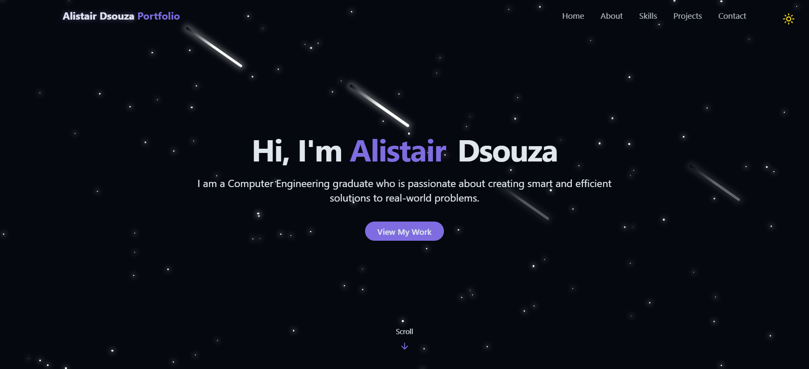

# 🌐 Personal Portfolio Website

Welcome to my personal portfolio website!  
This site showcases my **projects, achievements, and experiences** in computer science and software development.  

 <!-- Replace with actual screenshot -->

---

## ✨ Features

- **About Me** – Quick introduction about my background and interests  
- **Projects** – Highlighting key works such as:
  - 📊 Stock Market Predictor (ML + Python)
  - 📅 Event Scheduler (MERN Stack)
  - ✋ Computer Control using Hand Gestures (ML + TensorFlow)
- **Experience & Achievements** – Internship, open source, and hackathon highlights  
- **Contact & Links** – Easy access to my GitHub, LinkedIn, LeetCode, and more  

---

## 🛠️ Tech Stack

- **Frontend:** HTML, CSS, JavaScript, React, Tailwind CSS, Bootstrap  
- **Backend:** Flask / Node.js (depending on project integrations)  
- **Tools & Platforms:** GitHub, Firebase, MongoDB  
- **Other:** Responsive design with modern UI  

---

## 🚀 Getting Started

If you’d like to run this portfolio locally:

```bash
# Clone this repository
git clone https://github.com/YourUsername/portfolio.git

# Navigate to project folder
cd portfolio

# Install dependencies
npm install   # or yarn install

# Start development server
npm run dev   # or yarn dev
